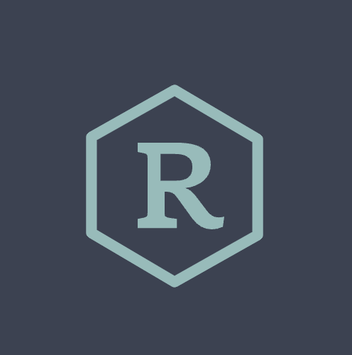

  

<h1 align="center">
 radatta.github.io
</h1>

  My personal website built with <a href="https://www.gatsbyjs.org/" target="_blank">Gatsby</a> and hosted with <a href="https://www.netlify.com/" target="_blank">Netlify</a>, heavily inspired by <a href="https://brittanychiang.com/" target="_blank">Brittany Chiang's website</a>.

